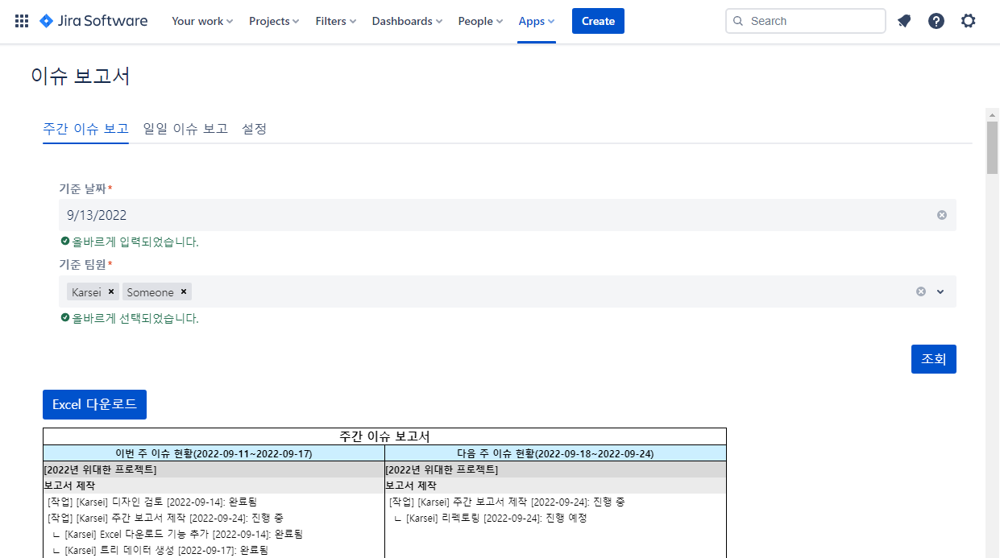
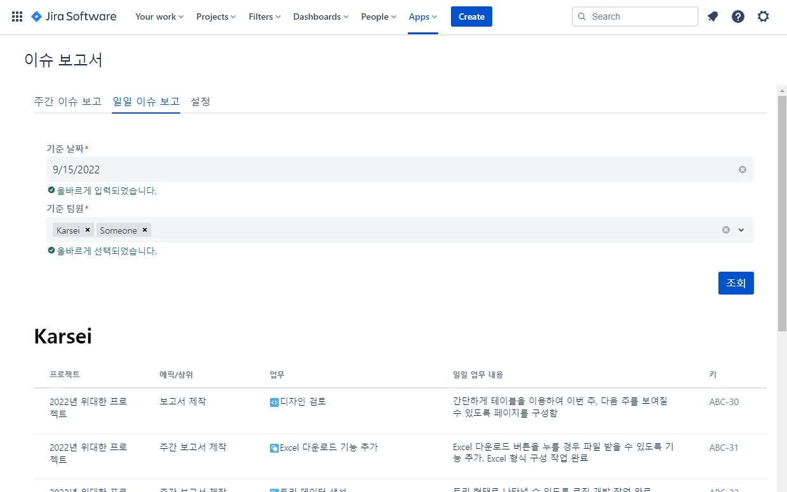
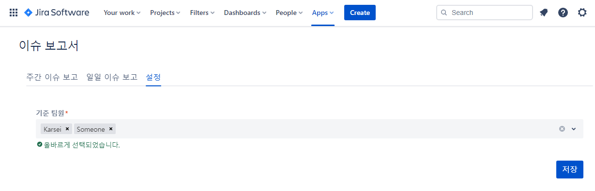
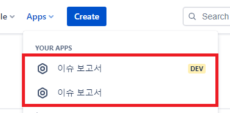

# 이슈 보고서

소규모 팀을 위한 서면 보고용 이슈 보고서 출력 앱이며, Atlassian Forge 를 이용하여 제작되었습니다.

> Jira Cloud 환경에서 제작되었으며, 설치형에서는 확인을 하지 못했습니다.
 
Jira 에서는 대시보드나 필터를 통해 기본적으로 트리가 아닌 목록 형태로 출력합니다. 임의의 디자인으로 트리 형태의 이슈를 보고 싶어서 제작되었습니다. 

# 기능

## 주간 보고서

이번 주와 다음 주의 이슈 목록을 출력합니다. 이슈들을 Excel 로 다운로드받아 사용자가 임의대로 구성하고 이용할 수 있습니다. 



## 일일 보고서

하루동안 진행한 일에 대해 보고서를 출력합니다. 이슈 댓글 첫 단어에 `#보고#` 가 포함되어 있으면 이 댓글을 그대로 보여줍니다. (물론, `#보고` 는 포함되지 않습니다.)



## 설정

기본적으로 검색 폼에서 선택될 항목을 저장합니다.



# Spec

* NodeJS v16.14
* React 16.8.6

> Atlaskit 이 React 16 을 이용하고 있기 때문에 같은 버전으로 따라갑니다.

# 사용법

Forge App 기본 사용법을 따라갑니다. Forge App 사용법에 대해서는 [Atlassian Forge 공식 문서](https://developer.atlassian.com/platform/forge/getting-started/) 를 참조하세요.

Atlassian 에서 제공하는 Forge 의 Jira API 를 사용하고 있으므로 실제 Jira 에 배포하면서 개발을 해야 합니다.

> 로컬에서 `npm start` 로 개발하고 싶어도, Forge 에서 로컬 환경에서의 개발을 제한하고 있습니다.

Forge 앱을 개발용, 상용으로 구분해서 Jira 에 배포할 수 있습니다.



먼저, Forge Cli 를 설치합니다.

```bash
$ npm install -g @forge/cli
```

Forge 를 이용하기 위해서는 미리 API Token 을 받아놓아야 합니다. [이곳](https://id.atlassian.com/manage-profile/security/api-tokens) 에서 API Token 을 발급받고 메모합니다.

아래의 명령어를 통해 로그인을 합니다. 이메일은 Atlassian 계정을 입력하고, API 토큰은 위에서 발급받은 토큰을 입력합니다.

```bash
$ forge login --verbose
# 또는 아래처럼 처음부터 파라미터를 전부 넣을 수 있습니다.
$ forge login -u [이메일] -t [API토큰]
```

> **self signed certificate 오류가 난다면?**
> 
> Forge API 를 이용할 때는 내부적으로 Graphql 을 이용하여 통신합니다. 보안을 위해 자체적으로 발급받은 인증서를 사용하고 있을 경우, HTTPS 를 무시하기 위해 하드코딩으로 아래 코드를 넣어줍니다.
> ```javascript
> process.env["NODE_TLS_REJECT_UNAUTHORIZED"] = 0;
> // 참고 - forge-cli 경로
> // /usr/local/lib/node_modules/@forge/cli/out/command-line/index.js : 58
> ```

`manifest.yml` 파일을 열고 `app:id:` 항목을 수정합니다.

이 과정에서 APP ID 가 필요하므로 아래 명령어를 통해 아무 프로젝트를 만든 뒤, 생성된 폴더에 있는 `manifest.yml` 의 `app:id:` 값을 가져와서 해당 앱의 `manifest.yml` 에 붙여넣습니다.

```bash
$ forge create
```

```yaml
app:
  # 이렇게 생겼습니다.
  id: ari:cloud:ecosystem::app/12345678-1a2b-1a2b-1a2b-1a2b3c4d5e6f
```

root 디렉토리에서 아래 명령어를 통해 라이브러리를 설치합니다.

이 과정을 통해 root 디렉토리에 있는 `src`, `static/globalpage-report-app` 폴더마다 라이브러리가 설치됩니다.

```bash
$ npm run ready
```

위 과정을 모두 거쳤다면 사용할 준비는 끝났습니다. 개발용으로 Jira 에 배포하고 싶다면 아래처럼 명령어를 입력합니다.

```bash
# [development 으로 배포]
# 아래 명령어를 수행하면 `static/globalpage-report-app` 디렉토리를 빌드한 후 Jira 에 배포합니다.
$ npm run deploy
$ forge install
```

> 위 명령어를 진행한 후에 개발 작업을 진행한다면, 다음부터는 `npm run deploy` 만 사용해도 됩니다.

상용으로 배포하고 싶다면 아래처럼 명령어를 입력합니다.

```bash
# [production 으로 배포]
# `static/globalpage-report-app` 디렉토리에 있는 앱이 빌드되어 있어야 합니다.
$ npm run deploy
$ forge deploy -e production
$ forge install
```

> 배포 시 `forge install --upgrade` 를 하라고 나오면 해당 명령어를 실행합니다.

## 참고사항

### 디렉토리 설명

* src - Atlassian Forge API 를 이용하기 위한 Resolver 앱
* static - Custom UI 리소스
  * globalpage-report-app - 이슈 보고서 앱
    * public - 출력 에셋
    * src - 소스
* manifest.yml - Jira 에 앱을 등록하고 화면에 보여주기 위해 필요한 메타 구성 정보

### References

https://developer.atlassian.com/platform/forge/getting-started/